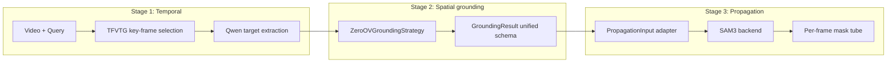

# STVG: Zero-Shot Spatio-Temporal Video Grounding

A **training-free**, **zero-shot** pipeline for Spatio-Temporal Video Grounding (STVG)
on **UAV-SAVG**. Given a video and a natural-language query
(e.g. *"the black all-terrain vehicle at the front of the curve"*), the system
localizes the target **in time** (key frame) and **in space** (a per-frame
segmentation mask tube).

The pipeline is organized as three composable stages behind stable interfaces:

| Stage | Role |
|-------|------|
| **Stage 1** | Temporal grounding: pick the key frame + extract target noun |
| **Stage 2** | Spatial grounding: predict a key-frame mask/bbox |
| **Stage 3** | Mask propagation: bbox -> per-frame mask tube |

Stage 1 uses the **same Qwen model as Stage 2** for target-object extraction.
Stage 2 emits a single unified output schema, so Stage 3 consumes it without
knowing how the bbox was produced.

---

## Architecture



Design principles:

- **High cohesion / low coupling.** Each stage talks to the next only through the
  dataclasses in [`stvg/schemas.py`](stvg/schemas.py).
- **Factory + Strategy.** The grounding model and propagation backend are selected
  through `create_grounding_model` / `create_propagation_backend`, so new
  strategies can be registered without touching call sites.
- **Non-destructive.** The original `stageN_*.py` research scripts are reused; the
  `stvg` package imports their functions lazily.

---

## Quick Start

```bash
# 1. Environment (training-free; no fine-tuning needed)
conda activate zys_vstg          # or your own env
pip install -r requirements.txt

# 2. Sanity check the package (no GPU / model weights required)
cd model
python -m pytest tests/ -q

# 3. Run the minimal pipeline on 10 UAV-SAVG clips
NUM=10 NUM_GPUS=1 bash scripts/run_savg.sh
```

---

## Minimal Run Recipe (UAV-SAVG)

The script exposes every hyperparameter as an environment variable; defaults are
in the header of [`scripts/run_savg.sh`](scripts/run_savg.sh).

```bash
# Full pipeline: Stage 1 -> Stage 2 (ZeroOV) -> Stage 3 (SAM3)
NUM=10 NUM_GPUS=4 RSVG_DIR=/path/to/RSVG-ZeorOV bash scripts/run_savg.sh
```

### Per-component (advanced)

```bash
# Stage 2 only (RSVG-ZeroOV; unified output written to <output_dir>/grounding/)
python -m stvg.cli.stage2_grounding --dataset savg --rsvg-dir /path/to/RSVG-ZeorOV

# Stage 3 only (SAM3; reads the unified grounding/ subdir)
python -m stvg.cli.stage3_propagation --dataset savg \
    --stage2-subdir grounding --stage3-subdir stage3_sam3 --num-gpus 4

# Stage 2 + Stage 3 in one process (small/demo runs)
python -m stvg.cli.run_pipeline --dataset savg --num 10
```

---

## Model Weights

Set paths in [`config.yaml`](config.yaml). Download links are placeholders — fill
them in for your environment.

| Model | Used by | Download (placeholder) |
|-------|---------|------------------------|
| BLIP-2 ITM (coco) | Stage 1 (key-frame ITM) | `<TODO: BLIP-2 link>` (auto from HF) |
| Qwen2.5-VL-7B-Instruct | Stage 1 (target extraction) + Stage 2 (RSVG-ZeroOV) | `<TODO: Qwen2.5-VL link>` |
| Stable Diffusion v1-4 | Stage 2 (RSVG-ZeroOV) | `<TODO: SD v1-4 link>` |
| CLIP ViT-B/16 | Stage 2 (RSVG-ZeroOV) | `<TODO: CLIP link>` |
| SAM2.1-hiera-base-plus | Stage 2 (RSVG-ZeroOV fusion) | `<TODO: SAM2 link>` |
| SAM3 | Stage 3 (propagation) | `<TODO: SAM3 link>` |

### Recommended weights directory tree

```text
weights/
├── blip2/                         # or rely on HuggingFace cache
├── Qwen2.5-VL-7B-Instruct/        # shared by Stage 1 + Stage 2
├── stable-diffusion-v1-4/
├── clip-vit-base-patch16/
├── sam2.1-hiera-base-plus/
└── sam3/
```

### Loading flow

1. Weight paths are resolved from `config.yaml` (keys: `rsvg.qwen_model`,
   `rsvg.sd_model`, `rsvg.sam_checkpoint`, `clip.model_path`, `sam3.model_path`).
2. Stage 1 target extraction reuses `rsvg.qwen_model` (the same Qwen as Stage 2).
3. Strategies/backends load weights **lazily** on first use, so importing `stvg`
   or running the unit tests requires no GPU and no weights.
4. `SAM3_MODEL_PATH` can override the SAM3 checkpoint via environment variable.

---

## Dataset Preparation (UAV-SAVG)

The dataset is **not** committed (`data/` is gitignored). Download UAV-SAVG and
arrange it as below; paths are configured under `datasets.savg` in
[`config.yaml`](config.yaml).

```text
data/
└── savg/
    ├── test_ann.json                     # annotations (vid, captions, bboxes, fps, ...)
    └── Test/Test/{vid}/                   # one folder per clip = JPEG image sequence
        ├── 000001.jpg, 000002.jpg, ...
        ├── img/
        └── groundtruth_rect.txt
```

| Dataset | `base_dir` | annotation | frames |
|---------|-----------|------------|--------|
| UAV-SAVG | `data/savg` | `test_ann.json` | `Test/Test/{vid}/` JPEG image folders |

### Download

| Dataset | Source (placeholder) |
|---------|----------------------|
| UAV-SAVG | `<TODO: UAV-SAVG download link>` |

> UAV-SAVG clips are stored as JPEG **image sequences** (not video files); the
> pipeline reads frames by index directly from the per-clip folder.

Pipeline **outputs** (Stage 1/2/3 artifacts) are written under the dataset's
`output_dir` (e.g. `model/output/savg/`) and are also gitignored.

---

## Stage I/O Reference

On-disk layout under the dataset `output_dir`:

```text
<output_dir>/
├── stage1/{base_vid}/{idx}/
│   ├── key_frame.png
│   ├── metadata.json          # text_query, target_object, video_path, *_frame_idx
│   └── similarity_scores.npy
├── grounding/{base_vid}/{idx}/
│   ├── key_frame.png
│   └── metadata.json          # unified Stage 2 (RSVG-ZeroOV) schema
└── stage3_sam3/{base_vid}/{idx}/
    ├── masks/mask_00000.png
    └── metadata.json
```

| Stage | Reads | Writes | Schema (key fields) |
|-------|-------|--------|---------------------|
| Stage 1 | video + annotations | `stage1/.../metadata.json` | `text_query`, `target_object`, `video_path`, `key_frame_idx`, `original_frame_idx` |
| Stage 2 | `stage1/.../` | `grounding/.../metadata.json` | `vid`, `text_query`, `target_object`, `method`, `success`, `bbox`, `confidence`, `answer`, `mask_path`, `raw_output`, `failure_reason`, `extras` |
| Stage 3 | `stage1/` + `grounding/` | `stage3_sam3/.../masks/` | `masks/mask_*.png`, `metadata.json` |

RSVG-ZeroOV-only signals (CLIP similarities, mask coverage) live under `extras`;
the mask itself is referenced by `mask_path`.

---

## Package Layout

```text
model/
├── stvg/
│   ├── schemas.py           # BBox, Stage1Record, GroundingResult, PropagationInput
│   ├── config.py            # config loading
│   ├── io/                  # stage1 scanning, grounding read/write, path helpers
│   ├── grounding/           # BaseGroundingModel + ZeroOV strategy + factory
│   ├── propagation/         # BasePropagationBackend + SAM3 backend + factory + adapter
│   ├── pipeline/            # stage2_runner, stage3_runner
│   └── cli/                 # stage2_grounding, stage3_propagation, run_pipeline
├── scripts/                 # run_savg.sh
├── tests/                   # pytest contract tests (no heavy deps required)
├── stage1_tfvtg.py          # legacy entrypoints (reused by stvg)
├── stage2_qwen_grounding.py
├── stage3_sam3_qwen.py
├── stage4_zeroov.py
└── config.yaml
```

---

## Testing

```bash
cd model
python -m pytest tests/ -q
```

The suite verifies the contracts that matter most:

- **Grounding output schema** — RSVG-ZeroOV emits the canonical Stage 2 schema for
  both success and failure (`test_stage2_strategy_contract.py`).
- **Stage 2 -> Stage 3 handoff** — the adapter raises a clear, named error rather
  than failing deep inside Stage 3 when a required key is missing
  (`test_stage2_to_stage3_adapter.py`).

All tests stub model inference, so they run in well under a second with no GPU.
